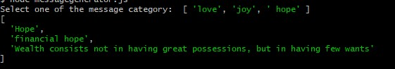

# Project Name
> This program will output a random inspirational message whenever a user selects a message category
> Message category -  Love, Joy, Hope
<!-- Live demo [_here_](https://www.example.com). <!-- If you have the project hosted somewhere, include the link here. -->

## Table of Contents
* [General Info](#general-information)
* [Technologies Used](#technologies-used)
* [Features](#features)
* [Screenshots](#screenshots)
* [Setup](#setup)
* [Usage](#usage)
* [Project Status](#project-status)
* [Room for Improvement](#room-for-improvement)
* [Acknowledgements](#acknowledgements)
* [Contact](#contact)
<!-- * [License](#license) -->

## General Information
- This program generates a random inspirational quote based on the message category selected by user
- Purpose - to provide hope to people who are down, heartbroken and hopeless people, and to master JavaScript by working on this project
<!-- You don't have to answer all the questions - just the ones relevant to your project. -->

## Technologies Used
Project is created with:
- JavaScript version ES6
- Git Bash - version 2.34.0.windows.1

## Features
List the ready features here:
- Message Category - User to select one of the three category (love, joy, hope)
- Message Quote - Program will output a random inspirational quote based on the message category selected

## Screenshots
Program Output

<!-- If you have screenshots you'd like to share, include them here. -->

## Setup
To run this project, install locally using npm:
- run node MessageGenerator.js

<!-- Proceed to describe how to install / setup one's local environment / get started with the project. -->

## Usage
Program will output a random inspirational quote based on your selection

## Project Status
Project is: completed

## Room for Improvement
To include a UI for user to select message category.

Room for improvement:
- Add a user interface for user to select message category

To do:
- To add an interactive user interface at later stage, after I learned front-end development tools and skillset

## Acknowledgements
Give credit here.
- This project was inspired by CodeAcademy -JavaScript Syntax Portfolio Project.
- This project was based on [Mixed Messages Group Portfolio project ](https://www.codecademy.com/paths/full-stack-engineer-career-path/tracks/fscp-javascript-syntax-portfolio-project/modules/fscp-mixed-messages/kanban_projects/mixed-messages).
- Many thanks to CodeAcademy

## Contact
Created by [@jeanietan](https://www.codecademy.com/paths/full-stack-engineer-career-path/tracks/fscp-javascript-syntax-portfolio-project/modules/fscp-mixed-messages/kanban_projects/mixed-messages) - feel free to contact me!

<!-- Optional -->
<!-- ## License -->
<!-- This project is open source and available under the [... License](). -->

<!-- You don't have to include all sections - just the one's relevant to your project -->
